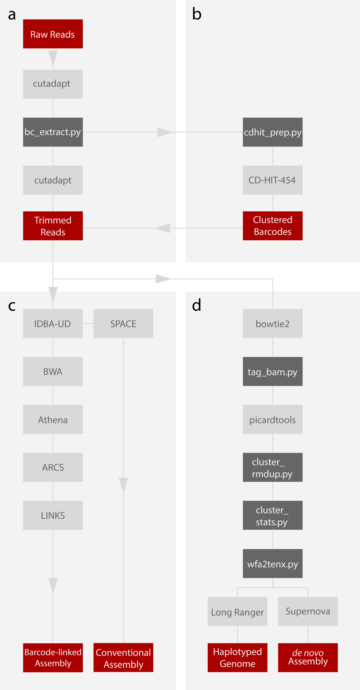

# WGH_Analysis

This GitHub repository describes and distributes all script used in "[Efficient whole genome haplotyping and 
high-throughput single molecule phasing with barcode-linked reads]()", see [figure 1](https://github.com/FrickTobias/WGH_Analysis/blob/master/README.md#overview) 
for overview. This GitHub is used for preprocessing of read data and takes raw fastq files as input and outputs 
either (1) fastq files for metagenomic _de novo_ analysis, (2) fastq files for Human Genome haplotyping or (3) 
bam files ready custom variant calling and phasing analysis. 

To run analyse (1) output and get metagenomic assemblies look at [WGH metagenomics](https://github.com/jennifertheland/WGH_metagenomics).
Processing of (2) for Human Genome Haplotyping or reference-free assemnbly please conside the [wfa2tenx](https://github.com/remiolsen/wfa2tenx)
GitHub.

## Dependencies

Here follows a list with links to all bioinformatical softwares needed to use of this part of the pipeline.

  - [cutadapt](https://github.com/marcelm/cutadapt.git)
  - [cd-hit-454](https://github.com/weizhongli/cdhit.git)
  - [bowtie2](https://github.com/BenLangmead/bowtie2)
  - [samtools](https://github.com/samtools/samtools)
  
It will also be required to have downloaded [Picard Tools](https://github.com/broadinstitute/picard) and a Bowtie2 
reference genome (e.g. GRCh38), available at e.g. [Illumina iGenomes](https://support.illumina.com/sequencing/sequencing_software/igenome.html). 
Lastly to utilize all aspects of the pipeline some GNU software are also needed.

  - [pigz](https://zlib.net/pigz/)
  - [mail](https://mailutils.org/manual/mailutils.html)

## Setup

First, download this GitHub repository by writing the cloning command in your terminal.

```
git clone https://github.com/FrickTobias/WGH_Analysis.git
```

Then provide WGH_Analysis with the appropriate paths for Picard Tools and your Bowtie2 reference data (consult 
[example folder](https://github.com/FrickTobias/WGH_Analysis/tree/master/example) details). 

```
bash setpath.sh </path/to/picardtools> </path/to/bowtie2_reference>
```

## Useage

For all available options, see -h (--help) and for more details consult the [step-by-step](https://github.com/FrickTobias/WGH_Analysis/tree/master/step-by-step) 
folder which describes all steps performed by WGH_automation. For examples and analysis file contents, see the [example folder](https://github.com/FrickTobias/WGH_Analysis/tree/master/example) 
where an example run is thouroughly described.

####_de novo_ Metagenomics

First trim read sequences and extract barcode sequences with WGH_automation using the -e 1 option.

```
bash WGH_automation.sh -r -m <john.doe@myworkplace.com -p <processors> <read_1.fq> <read_2.fq> <output> 
```

Now cluster barcode sequences with the -s 3 -e 3 options.

```
bash WGH_automation.sh -r -m <john.doe@myworkplace.com -p <processors> <read_1.fq> <read_2.fq> <output> 
```

Following this, run athena_assembly.sh provided through the [WGH metagenomics](https://github.com/jennifertheland/WGH_metagenomics) 
GitHub repository.

####Human Haplotyping and Assembly

Start by running the complete preprocessing pipeline with the fastq generation option.

```
bash WGH_automation.sh -r -m <john.doe@myworkplace.com -p <processors> <read_1.fq> <read_2.fq> <output> 
```

Continue by converting filtered fastq files to Long Ranger/Supernova input format using [wfa2tenx](https://github.com/remiolsen/wfa2tenx)
and run the appropriate pipeline.


####Custom Phasing Analysis

Run the preprocessing pipeline using default settings.

```
bash WGH_automation.sh -r -m <john.doe@myworkplace.com -p <processors> <read_1.fq> <read_2.fq> <output> 
```

## Overview



**Figure 1:** Overview. Data analysis overview. **(a)** Reads are trimmed for their first handle using cutadapt
followed by extraction fo the barcode sequence to a separate fasta files. Reads continue to be trimmed for 
another handle sequence just before the insert sequences and lastly reads are stripped of any traces of 
reverse complements of handle sequences from their 3' end. **(b)** Barcodes are split into several files files 
depending on their first three bases and clustered independently using CD-HIT-454. These are then combined into a 
summary file, NNN.clstr. **(c)** Trimmed reads are assembled into an initial assembly with IDBA-UD which is 
then used as reference for mapping the origin trimmed reads to with BWA which also incorporates the clustered
barcode sequences into the resulting bam file. The bamfile is used to assemble the original read data, using 
the spacially devided (mapping positions) barcode information. The resulting assembly is then processed by ARCS
and put into LINKS to yield the final scaffolds. **(d)** Trimmed reads are mapped with Bowtie2 converted to bam
files. This bam file is tagged with barcode information by tag_bam.py. Picardtools is used to remove PCR and 
optical duplicates and is then used again to mark duplicate positions where reads have different barcodes. 
The marked bam file is filtered for barcode duplicates using cluster_rmdup.py and subsequently filtered for 
clusters with large amounts of molecules by filter_clusters.py. This bam file has its reads converted to fastq
files and converted according to input format specifications of Long Ranger and Supernova by wfa2tenx.py.